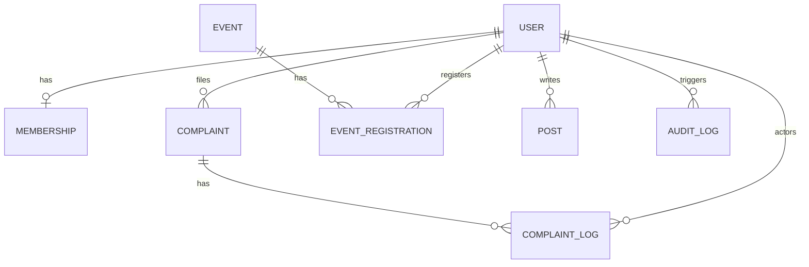

# Voice of Northern (VON) - Project Analysis and Status Report

This document presents a comprehensive project analysis and current status report for the **Voice of Northern (VON)** platform. It reviews the directory structures, details the engineering guidelines, maps the active frontend components, and outlines the immediate steps for backend integration and database scaffolding.

---

## 1. Project Overview & Objectives

**Voice of Northern (VON)** is a production-grade web platform designed for a student organization at Northern University. It centralizes student rights advocacy, organizational communications, and event management. The platform aims to digitize and unify activities previously managed across fragmented social media groups (Facebook, Messenger, WhatsApp).

### Core Features
- **Student Rights Advocacy & Complaint Management**: A structured pipeline allowing students to submit grievances and track resolutions transparently.
- **Double-Blind Anonymity**: Complainants can choose to hide their identity. Relational user details are encrypted in the database and hidden from public layers. Unlocking details requires a Super Admin action, logging an immutable audit record.
- **Manual Membership Verification**: Registration acts as a membership application, requiring student credentials and ID photo uploads for manual verification by administrators.
- **Event Management**: Streamlining registration for Free, Contribution, or Paid events with manual payment verification.
- **Unified Visual Content Editor**: Rich text and Markdown editor support for announcements, blogs, and university digital magazines.
- **Critical Gateway Notifications**: Cost-efficient, targeted WhatsApp/SMS notification triggers bound strictly to critical status updates.

---

## 2. Active Directory & Codebase Structure

The project is structured under a client-server architecture. The backend folder scaffolding is defined in the plan, while the frontend Next.js application has been bootstrapped.

```
Voice-Of-Northern/
├── frontend/                  # Next.js 16 (App Router) + TypeScript UI Client
│   ├── src/
│   │   ├── app/               # Page routing groups and layouts
│   │   │   ├── (auth)/        # Authentication (Login & Student Registration)
│   │   │   │   ├── login/
│   │   │   │   └── register/
│   │   │   ├── (public)/      # Open-facing layouts and details
│   │   │   │   ├── about/
│   │   │   │   ├── complaints/
│   │   │   │   └── contact/
│   │   │   ├── dashboard/     # Student portal & dashboard management
│   │   │   │   ├── complaints/
│   │   │   │   └── profile/
│   │   │   └── layout.tsx     # Root application HTML wrapper and SEO headers
│   │   ├── components/        # Atomic UI kit components (Button, Input)
│   │   ├── modules/           # Feature modules with local state & mock data
│   │   │   ├── auth/          # Authentication state providers and types
│   │   │   ├── complaint/     # Complaint structure, logs, and mocks
│   │   │   ├── event/         # Event schemas, pricing, and mocks
│   │   │   ├── notice/        # Notice priority listings and mocks
│   │   │   └── new_module_template/
│   │   └── styles/            # Tailwind CSS configuration and themes
│   ├── package.json           # Node packages (Next.js 16.2.6, React 19.2.4)
│   ├── tsconfig.json          # TypeScript configurations (Strict Mode enabled)
│   └── tailwind.config.js     # Tailwind v4 theme mapping (Navy, Cyan, Orange)
├── docs/                      # Technical plans, design specifications, guidelines
│   ├── design/                # System interface UI specifications
│   ├── development/           # Code setup checklists and walkthrough logs
│   ├── engineering/           # Engineering best practices, standards, and security
│   ├── requirements/          # SRS specifications and PDF proposals
│   └── implementation_plan.md # Database and execution path plan
```

---

## 3. Engineering Guidelines & Design Constraints

The development lifecycle enforces strict rules defined in the `docs/engineering/` directory:

### Coding Standards (`docs/engineering/coding-standards.md`)
- **Naming Conventions**: `camelCase` for variables and functions; `PascalCase` for React components; `kebab-case` for files and folders; `UPPER_SNAKE_CASE` for constants.
- **Types**: Strict type checking with TypeScript (`strict: true`). Avoidance of `any` types.
- **Structure**: Functions must be single-purpose and kept below ~30 lines. Deep nesting is prohibited.

### Security Guidelines (`docs/engineering/security-guidelines.md`)
- **Anonymity Protection**: Relational links, profile details, and names of anonymous submitters must not be exposed. Sensitive fields support database column-level encryption.
- **Immutable Audit Trails**: Revealing an anonymous identity requires a Super Admin clearance level. The action triggers a transaction appending the action and required justification to the `AuditLog` table.
- **Media Upload Limitations**:
  - Images (JPEG/PNG): Max 5MB
  - Documents (PDF): Max 10MB
  - Video (MP4): Max 100MB
- **Authentication**: JWT token-based authentication with secure flags (`httpOnly`, `secure`, `sameSite: "strict"`). Hashing with `bcrypt` or `argon2`.
- **Database Safeguards**: Column-level encryption in PostgreSQL for sensitive tables. Parametrized queries via Prisma ORM to mitigate SQL Injection.

---

## 4. Current Implementation Status

The frontend is fully configured with interactive routing, responsive layouts, tailwind v4, and custom components. The following table tracks implementation coverage:

| Feature / Module | Route / File Path | Status | Details |
| :--- | :--- | :--- | :--- |
| **Global Theme** | `styles/globals.css` | **Complete** | Setup of "Outfit" Google Font, custom scrollbar styling, and Navy-Cyan-Orange palette. |
| **Authentication** | `/login` | **UI Complete** | Secure student login screen collecting email and password. |
| **Authentication** | `/register` | **UI Complete** | Registration form collecting student ID, department, batch, and supporting file upload widget for Student ID card proof. |
| **Public Portal** | `/` (Home) | **Complete** | Showcase page with hero banner, latest notices, and upcoming activism events. |
| **Public Portal** | `/about` | **Complete** | Informational profile detailing the organization's goals. |
| **Public Portal** | `/contact` | **Complete** | Interactive form for inquiries. |
| **Complaints** | `/complaints` | **UI Complete** | Public feed displaying approved, resolved, or under review complaints. |
| **Complaints** | `/complaints/[id]` | **UI Complete** | Visual tracker page showing status pipeline timeline, attachment logs, and administrator remarks. |
| **Dashboard** | `/dashboard/profile` | **UI Complete** | Displays active account verification, membership tier status, and student info. |
| **Dashboard** | `/dashboard/complaints/create` | **UI Complete** | Multipart complaint creation form. Features a prominent anonymous toggle button and file drag-drop widget. |
| **Dashboard** | `/dashboard/complaints/my-complaints` | **UI Complete** | Table grid lists all complaints created by the student, showing verification state and tracking links. |
| **Atomic UI Kit** | `components/ui/` | **Complete** | Reusable `Button` (primary, secondary, danger, ghost variants with hover micro-animations) and custom styled `Input`. |

*Note: All current features utilize mock telemetry data provided in `modules/*/mock-*.ts` files.*

---

## 5. Architectural Data Model (Proposed Prisma Schema)

The database schema (PostgreSQL managed via Prisma ORM) is planned as follows:



- **User**: Details names, department, student ID, password hash, and roles (`SUPER_ADMIN`, `ADMIN`, `MODERATOR`, `COMPLAINT_OFFICER`, `EVENT_MANAGER`, `CONTENT_WRITER`, `MEMBER`, `GUEST`). Supports soft delete.
- **Membership**: Student verification tracking (Pending, Approved, Rejected).
- **Complaint**: Grievance storage. Supports file attachments, statuses, public visibility flag, and anonymity toggles.
- **AuditLog**: Immutable trails capturing identity access lookups (e.g., identity unlocks by Super Admin).

---

## 6. Development Roadmap & Next Steps

1. **Scaffold Backend Project Structure**:
   - Initialize a Node.js + Express.js + TypeScript server under `backend/`.
   - Set up Prisma ORM and establish connection to the target PostgreSQL instance.
2. **Build Database Migrations**:
   - Sync schemas for `User`, `Membership`, `Complaint`, `Event`, `Notice`, `Post`, and `AuditLog` as defined in the SRS and implementation plan.
   - Set up seed scripts to populate default roles and initial Super Admin.
3. **API Endpoints Development**:
   - **Auth**: User registration (handling student ID photo upload) and login (issuing JWT cookies).
   - **Complaints**: Creation, tracking, and approval workflows.
   - **Events**: Ticketing and registration with manual verification logs.
4. **Enforce Double-Blind Security**:
   - Implement the `GET /api/complaints/:id/reveal-identity` clearance middleware (restricting to `SUPER_ADMIN`).
   - Hook up a database transaction ensuring identity reveals write to the `AuditLog` table.
5. **Gateway Notification Service Integration**:
   - Set up HTTP connectors targeting Bulk SMS BD APIs.
   - Build listeners that fire SMS/WhatsApp triggers strictly on specific state changes (e.g., Complaint resolved).

---

## 7. Troubleshooting & Execution Guidelines

### Running CLI Commands
The root folder `h:\VON\Voice-Of-Northern` does not contain a `package.json` file. Running `npm run dev` or `npm run lint` directly in the root workspace will result in an `ENOENT: no such file or directory` error.

To start or maintain the application, navigate to the `frontend` sub-directory:
```powershell
# Navigate to the frontend directory
cd frontend

# Run the development environment
npm run dev

# Run lint checks
npm run lint

# Build production bundle
npm run build
```
